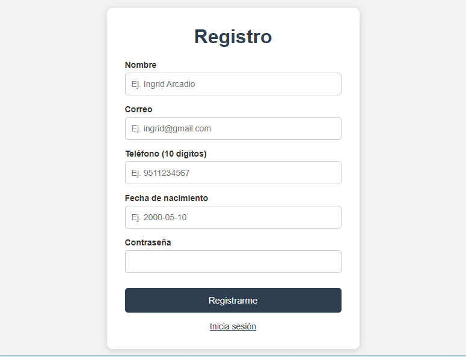
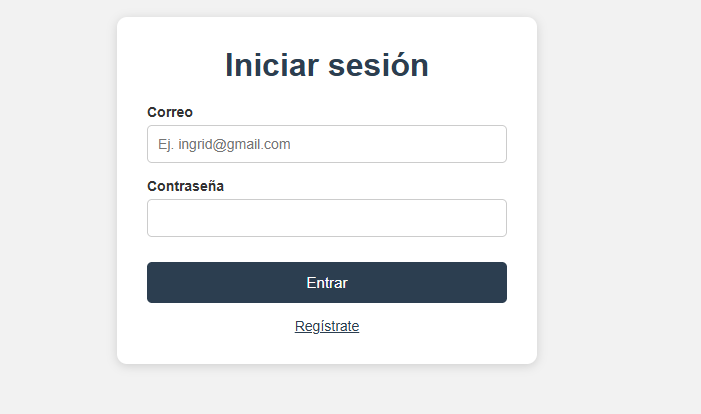
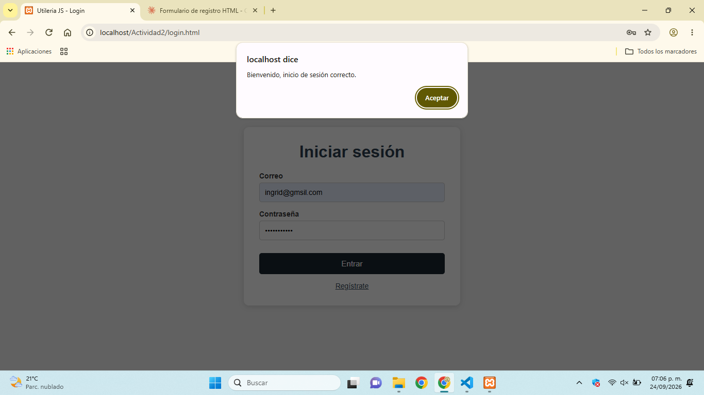

# Utileria JS

Librería de JavaScript con funciones de validación y formateo para formularios, modales y pantallas de inicio de sesión. Sin frameworks, sin dependencias.

**Autora:** Ingrid Arcadio Aparicio

## ¿Qué problema resuelve?

Cuando se construye un formulario, siempre se repite el mismo trabajo: validar que el correo tenga formato correcto, que la contraseña sea segura, que el nombre no traiga números, calcular la edad a partir de una fecha de nacimiento, etc. **Utileria JS** junta todas esas validaciones comunes en un solo archivo reutilizable, para no escribir ese código una y otra vez en cada proyecto.

## Instalación

Descarga el archivo `utileria.js` de la carpeta `/js` y agrégalo a tu HTML antes de tu propio script:

```html
<script src="js/utileria.js"></script>
```

## Uso

### validarCorreo(correo)
Valida que un texto tenga el formato de un correo electrónico.

```javascript
validarCorreo("ingrid@mail.com"); // true
validarCorreo("ingrid@mail");     // false
```

### soloLetras(texto)
Valida que un texto contenga solo letras (mayúsculas, minúsculas y vocales acentuadas).

```javascript
soloLetras("María");   // true
soloLetras("Ingrid2"); // false
```

### validarLongitud(numero, maxLongitud)
Valida que un número no exceda una cantidad máxima de dígitos.

```javascript
validarLongitud("12345", 5);  // true
validarLongitud("123456", 5); // false
```

### calcularEdad(fechaNacimiento)
Calcula la edad en años cumplidos a partir de una fecha de nacimiento.

```javascript
calcularEdad("2000-05-10"); // ej. 26
```

### esMayorDeEdad(fechaNacimiento)
Valida si una persona es mayor de edad (18 años o más).

```javascript
esMayorDeEdad("2000-05-10"); // true
esMayorDeEdad("2015-05-10"); // false
```

### validarPassword(password)
Valida que una contraseña tenga mayúscula, minúscula, número, carácter especial y mínimo 8 caracteres.

```javascript
validarPassword("Clave123!"); // true
validarPassword("clave123");  // false
```

### validarTelefono(numero)
Valida que un teléfono tenga exactamente 10 dígitos (acepta espacios o guiones como separadores).

```javascript
validarTelefono("951 123 4567"); // true
validarTelefono("12345");        // false
```

### capitalizarTexto(texto)
Convierte la primera letra de cada palabra a mayúscula.

```javascript
capitalizarTexto("juan perez");  // "Juan Perez"
capitalizarTexto("MARÍA lópez"); // "María López"
```

## Integración

- **`index.html`** — formulario de registro que usa `soloLetras`, `validarCorreo`, `validarTelefono`, `esMayorDeEdad`, `validarPassword` y `capitalizarTexto`. Al enviarse correctamente, muestra en un modal la edad calculada con `calcularEdad`.
- **`login.html`** — formulario de inicio de sesión que usa `validarCorreo` y `validarPassword`.

## Capturas de pantalla

**Registro (formulario + consola + modal):**




**Registro exitoso**


**Login (formulario + consola):**




**Entrar**



## Sitio web

🔗 GitHub Page: https://ingridthv.github.io/Utileria-js/

## Video

🎥 *(link al video aquí)*
